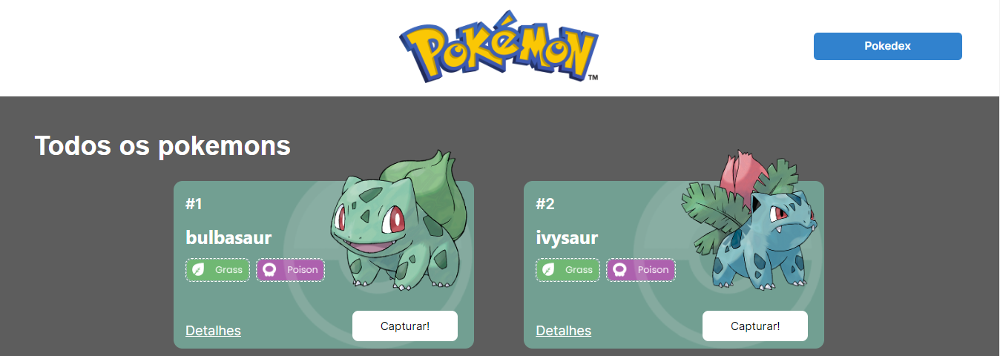
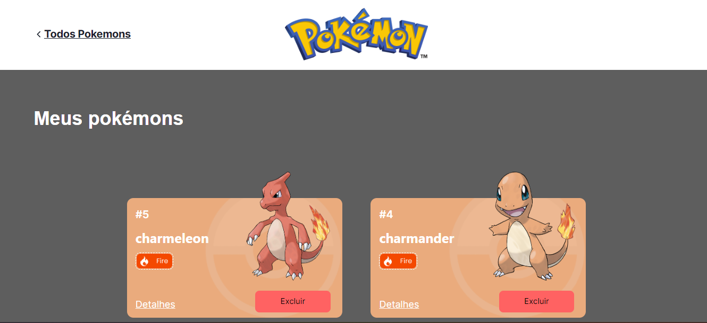
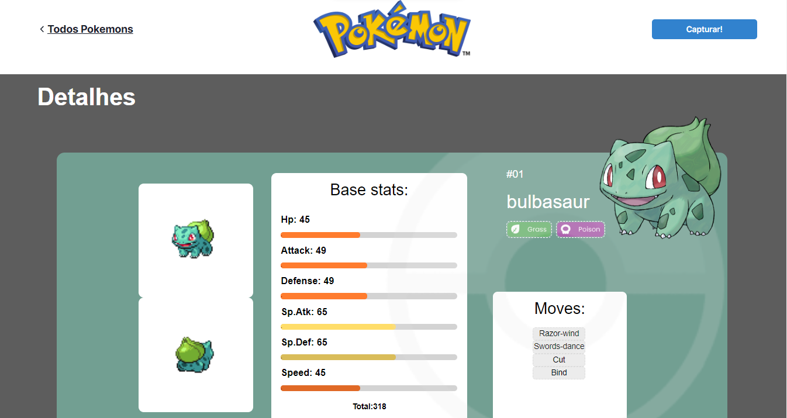

# Projeto Pokédex
O Projeto React e APIs é um site de pokémons que possui três páginas: Home, Pokedex e Detalhes. 

Este projeto teve como fonte de dados para a criação a [Poke Api](https://pokeapi.co/ "Poke Api"), uma Api pública.

Os conteúdos principais aplicados são:

- Integração de APIs
- React Router
- Design Systems
- Estado Global

## **Enunciado**
É objetivo deste projeto criar um site com três páginas usando a Poke Api com as seguintes ferramentas:

- React
- React Router
- Styled-components
- React Context
- Axios

## Índice
- <a href="#-Funcionalidades do Projeto">Funcionalidades do Projeto</a>
- <a href="#-Layout">Layout (Paths)</a>
- <a href="#-Visualizar este projeto">Visualizar este projeto</a>
- <a href="#-Como rodar este projeto">Como rodar este projeto</a>
- <a href="#-Requisitos do projeto">Requisitos do projeto </a>
- <a href="#-Tecnologias Utilizadas">Tecnologias Utilizadas</a>
- <a href="#-Pessoas autoras">Pessoas autoras</a>
- <a href="#-Próximos Passos">Próximos Passos</a>

## ⚒ Fucionalidades do Projeto

O Projeto Pokédex apesar do seu funcionamento ser bem simples, requer sólidos conceitos de programação, o projeto é constituído por três páginas: Home, Pokédex e Detalhes, na página Home ficam todos pokémons disponíveis e o usuário tem a possibilidade de ver mais detalhes ou capturar o pokémon, ao ser capturado é exibida uma mensagem e ele desaparece da lista de disponíveis e passa a fazer parte da pokédex, já na pokédex o usuário também pode ver mais detalhes assim como pode remover o pokémon da pokédex. A fonte de dados é uma API pública (Pokeapi) que é muito utilizada para fins acadêmicos e processos seletivos.

## 📸Layout





## 🧑‍💻Visualizar este projeto

[link da Pokedéx](https://pokedex-bruno-moura.surge.sh/)

## 📝 Como rodar este projeto
- Caso queira baixar e instalar este projeto em seu computador, é necessário que tenha o git e o node instalados.

### Links: 
✅[Node](https://nodejs.org/en)
<br><br>
✅[Git](https://git-scm.com/)

- Se já tem ambos instalados ou após instalar, siga os passos abaixo:

```bash
# Copie o link a baixo

https://github.com/BrunoNMoura/Pokedex-project-BrunoMoura

# Abra um terminal e digite o seguinte comando

git clone (cole a url aqui)

# acesse a página criada 

cd Pokedex-project-BrunoMoura

# Instale as dependências

npm install
ou
yarn install

# Executando o Projeto

npm run start
ou
yarn start
```

## 📝 Requisitos do Projeto

- **Gerais:**
	- ✅ O site deve ter 3 páginas: Home, Pokedex e Detalhes;
	- ✅ Projeto deve seguir o [design](https://www.figma.com/file/KseyA2Ofghiek2Cy3ZaDre/Poked%C3%A9x?t=AEi3zEmWmarf1FbP-0 "design") proposto;
	- ✅ O fluxo de trocas de páginas devem ser semelhante ao [fluxograma](https://www.figma.com/proto/KseyA2Ofghiek2Cy3ZaDre/Poked%C3%A9x?page-id=0%3A1&node-id=2%3A2&viewport=358%2C197%2C0.27&scaling=scale-down&starting-point-node-id=2%3A2 "fluxograma");
- **Página Home:**
	- ✅  Mostrar uma lista de Pokemons, contendo ao menos 20 Pokemons;
	- ✅ Cada Pokemon será representado por um Card;
	- ✅ Em cada card de Pokemon tem um botão para adicioná-lo à Pokedex e um outro botão para acessar os detalhes do Pokemon;
	- ✅ Header dessa página terá um botão para acessar a página da Pokedex
- **Página Pokédex**
	- ✅ Renderizar a lista de pokémons adicionados na pokedex;
	- ✅ Em cada card de Pokemon deve ter um botão para removê-lo da Pokedex e um outro botão para acessar os detalhes do Pokemon.
	- ✅ Header deve ter um botão para voltar para a Home
	- ✅ Não deve ser possível adicionar o mesmo Pokemon duas vezes na Pokedex
- **Página de Detalhes**
	- ✅ Mostrar os detalhes do Pokemon selecionado, com informações descritas
	- ✅ Header deve ter um botão para adicionar ou remover da Pokedex e outro para voltar a página home.
- ✅ [Criar um readme](https://www.youtube.com/watch?v=1QKwP0SJK-c "Crie um readme") para o projeto;

## 💻 Tecnologias Utilizadas

✅[HTML5](https://developer.mozilla.org/pt-BR/docs/Web/HTML)
✅[JavaScript](https://www.javascript.com/)
✅[React.js](https://pt-br.legacy.reactjs.org/)
✅[ReactRouter](https://reactrouter.com/en/main)
✅[styled-components](https://styled-components.com/)
✅[Git](https://git-scm.com/)

## 🏆 Desenvolvedor


<br>
Bruno Nascimento Moura
<br>
[Linkedin](https://www.linkedin.com/in/bruno-moura-dev/)